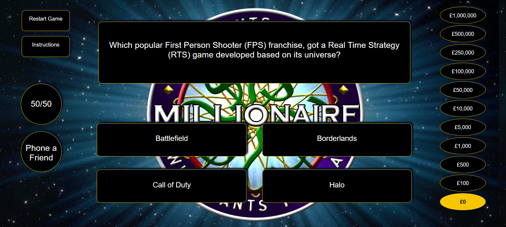

# Millionaire Game Project

I was tasked with creating a game using HTML, CSS and Javascript. I decided to make a "Who Wants To Be A Millionaire" quiz game, complete with lifelines and sounds.

## Where to play

[link](Click here to play)

## Instructions

Click the correct answer to move on to the next question. 10 correct answers in a row lands you £1,000,000!

###### Lifelines
50/50: Clicking this button will remove two incorrect options.

Phone a Friend: Clicking this button will call one of your friends, who may point you to the correct answer.

## Technology Used

* HTML
* CSS
* Javascript
* Atom
* Trello
* Github
